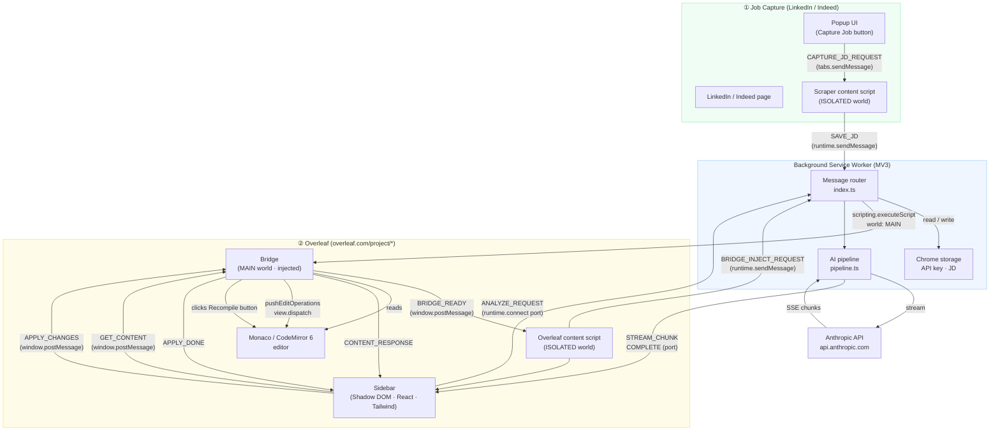

# FlowCV


**FlowCV** is a Chrome extension that tailors your Overleaf LaTeX resume to a specific job description using Claude AI. Open a job posting on LinkedIn or Indeed, click Capture, and the extension proposes targeted edits directly inside your Overleaf editor — with word-level diff previews and one-click apply that auto-recompiles.

---

## Features

- **JD scraping** — captures job title, summary, qualifications, responsibilities, keywords, and seniority level from LinkedIn and Indeed
- **AI-powered tailoring** — Claude rewrites resume bullets to mirror the JD's exact keywords and quantify every bullet with metrics
- **Word-level diff preview** — before/after view with deleted words in red and inserted words in green
- **One-click apply** — patches your Overleaf LaTeX document in place and automatically triggers recompile
- **ATS optimization** — prompt engineered for Workday, Greenhouse, Lever, and iCIMS keyword scoring
- **Safety validation** — brace balance checks and command allowlist prevent malformed LaTeX from reaching your document

---

## How it works

1. Open a job posting on LinkedIn or Indeed
2. Click the FlowCV popup icon → **Capture Job**
3. Open your resume on Overleaf
4. Click the FlowCV sidebar toggle button (right edge of the editor)
5. Review proposed changes with before/after word diffs
6. Select the changes you want and click **Apply** — Overleaf recompiles automatically

---

## Architecture



### Component roles

| Component | World | Responsibility |
| --------- | ----- | -------------- |
| **Popup** | Extension page | Triggers JD capture; links to Settings |
| **Scraper** content script | ISOLATED | Extracts JD from LinkedIn / Indeed DOM; saves to storage |
| **Background SW** | Service worker | Message router; stores JD & settings; runs AI pipeline |
| **AI pipeline** | Service worker | Builds Claude prompt, streams response, validates output |
| **Overleaf** content script | ISOLATED | Injects bridge; mounts Shadow DOM sidebar |
| **Bridge** | MAIN | Reads/writes Monaco & CodeMirror 6; triggers recompile |
| **Sidebar** | Shadow DOM | React UI — diff preview, change selection, apply |

### Key design decisions

- **MAIN world injection** — `chrome.scripting.executeScript({ world: 'MAIN' })` from the background SW bypasses Overleaf's CSP so the bridge can access `window.monaco` directly.
- **Streaming port** — A `chrome.runtime.onConnect` long-lived port keeps the MV3 service worker alive for the full Claude stream (avoids the 30 s SW kill).
- **Shadow DOM + Tailwind v3** — The sidebar is fully style-isolated. Tailwind v3 is required; v4 uses `@property` / `:root` variables that break inside a shadow root.
- **Dual editor support** — Bridge tries Monaco first, then falls back to CodeMirror 6 (current Overleaf), reading minified property names to locate the `EditorView`.
- **Safety validator** — Before any AI output touches your document: brace balance check, command allowlist, and a minimum-length guard.

---

## Tech stack

| Layer           | Tech                                    |
| --------------- | --------------------------------------- |
| Framework       | React 18 + TypeScript (strict)          |
| Build           | Vite 5 + CRXJS 2.0 beta                 |
| Styling         | Tailwind CSS v3 (Shadow DOM compatible) |
| Fonts           | Inter (Google Fonts)                    |
| State           | Zustand v5                              |
| AI              | Anthropic Claude (claude-sonnet-4-6)    |
| Package manager | pnpm                                    |
| Manifest        | MV3                                     |
| Tests           | Vitest + jsdom                          |

---

## Development setup

```bash
# Install dependencies
pnpm install
pnpm approve-builds   # required once for esbuild native binary

# Build extension (outputs to dist/)
pnpm build

# Run unit tests
pnpm test
```

After building, load the `dist/` folder as an unpacked extension in `chrome://extensions`.

---

## Project structure

```text
src/
├── background/           # MV3 service worker
│   ├── ai/               # Claude streaming pipeline, prompt builder, safety validator
│   └── index.ts          # Message router, JD store
├── content/
│   ├── overleaf/         # Overleaf sidebar UI (React, Shadow DOM)
│   │   ├── components/   # ChangePreview, ApplyButton, JobContextPanel, ...
│   │   └── sidebar/      # Mount point, toggle button
│   └── scraper/          # LinkedIn/Indeed JD extraction
│       ├── keywords.ts   # Keyword pattern matching
│       ├── utils.ts      # Pure text cleaning + section parsing
│       └── index.ts      # Content script entry, Chrome message listener
├── injected/
│   └── bridge.ts         # MAIN world bridge (Monaco + CodeMirror 6 editor access)
├── lib/
│   └── latex-parser.ts   # LaTeX block parser (resumeSubheading, section, ...)
├── popup/                # Extension popup UI
├── options/              # Settings page (API key)
├── store/                # Zustand stores (JD, changes)
└── types/                # Shared TypeScript types
```

---

## Permissions

| Permission                | Reason                                                          |
| ------------------------- | --------------------------------------------------------------- |
| `storage`                 | Persists the captured job description across sessions           |
| `activeTab`               | Reads the current tab URL to detect LinkedIn/Indeed             |
| `scripting`               | Injects the Monaco/CodeMirror bridge into Overleaf's MAIN world |
| Host: `overleaf.com`      | Runs the sidebar content script and bridge injection            |
| Host: `linkedin.com`      | Runs the JD scraper content script                              |
| Host: `indeed.com`        | Runs the JD scraper content script                              |
| Host: `api.anthropic.com` | Streams Claude API responses from the service worker            |

---

## Privacy

See [PRIVACY.md](./PRIVACY.md) for the full privacy policy.

---

## License

MIT
