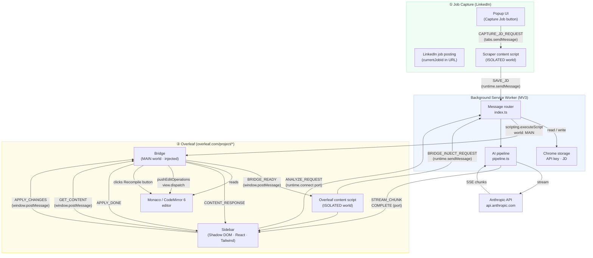

# FlowCV


**FlowCV** is a Chrome extension that tailors your Overleaf LaTeX resume to a specific job description using Claude AI. Open a job posting on LinkedIn, click Capture, and the extension proposes targeted edits directly inside your Overleaf editor — with word-level diff previews and one-click apply that auto-recompiles.

---

## Features

- **JD scraping** — captures job title, summary, qualifications, responsibilities, keywords, and seniority level from LinkedIn
- **AI-powered tailoring** — Claude rewrites resume bullets to mirror the JD's exact keywords and quantify every bullet with metrics
- **Word-level diff preview** — before/after view with deleted words in red and inserted words in green
- **One-click apply** — patches your Overleaf LaTeX document in place and automatically triggers recompile
- **ATS optimization** — prompt engineered for Workday, Greenhouse, Lever, and iCIMS keyword scoring
- **Safety validation** — brace balance checks and command allowlist prevent malformed LaTeX from reaching your document

---

## How it works

1. Open a job posting on LinkedIn (URL must contain `currentJobId`)
2. Click the FlowCV popup icon → **Capture Job**
3. Open your resume on Overleaf
4. Click the FlowCV sidebar toggle button (right edge of the editor)
5. Review proposed changes with before/after word diffs
6. Select the changes you want and click **Apply** — Overleaf recompiles automatically

---

## Architecture



---

## How the bridge works

Overleaf's editor is a full JavaScript application running in the page's own JavaScript context. Chrome content scripts run in an **ISOLATED world** — they share the DOM with the page but have a completely separate JavaScript heap. This means a content script cannot read `window.monaco` or access any of Overleaf's internal editor objects.

FlowCV solves this with a two-world bridge pattern.

### The two-world problem

| World | Who runs here | Can access |
|-------|---------------|------------|
| **MAIN** | The page itself (Overleaf's app code) | `window.monaco`, CodeMirror `EditorView`, all page globals |
| **ISOLATED** | Chrome content scripts | DOM only — page JS globals are invisible |

### Injecting into MAIN world

When the Overleaf content script initialises, it sends a `BRIDGE_INJECT_REQUEST` message to the background service worker. The background SW then calls:

```ts
chrome.scripting.executeScript({
  target: { tabId },
  files: ['src/injected/bridge.ts'],
  world: 'MAIN',          // ← runs in the page's own JS context
})
```

This bypasses Overleaf's Content Security Policy because `chrome.scripting.executeScript` is a browser-level API that CSP cannot block. A `<script>` tag injection would be blocked by Overleaf's CSP.

### Communication across worlds

Once injected, the bridge and the sidebar (ISOLATED world) communicate exclusively via `window.postMessage`. Both worlds share the same `window` object for DOM events, making this the only safe cross-world channel.

```
Sidebar (ISOLATED)                      Bridge (MAIN)
─────────────────────────────────────────────────────────
window.postMessage({                     window.addEventListener('message', ...)
  source: 'LATEX_FLOW_CONTENT',    →    reads msg.source to filter own messages
  type:   'LATEX_FLOW_GET_CONTENT',
  requestId: '<uuid>',
})
                                   ←    window.postMessage({
                                           source: 'LATEX_FLOW_BRIDGE',
                                           type:   'LATEX_FLOW_CONTENT_RESPONSE',
                                           requestId: '<same uuid>',
                                           payload: { content: '...' },
                                         })
```

The `requestId` pairs each response to its request so concurrent calls don't collide.

### Reading the editor

The bridge tries two editor APIs in order:

1. **Monaco** (older Overleaf) — `window.monaco.editor.getEditors()[0].getModel().getValue()`
2. **CodeMirror 6** (Overleaf 2023+) — locates the `EditorView` from the `.cm-content` DOM element

For CodeMirror 6, Overleaf's production bundle is minified so the standard `element.cmView` property may be renamed to a short key. The bridge scans every own enumerable property of `.cm-content` looking for anything that satisfies the `EditorView` interface (`state.doc.toString` + `dispatch`). This makes it resilient to minifier renames.

### Applying edits

Changes are applied using each editor's native API so that Overleaf's own undo/redo stack is preserved:

- **CodeMirror 6** — `view.dispatch({ changes: { from, to, insert } })`
- **Monaco** — `model.pushStackElement()` + `model.pushEditOperations(...)` + `model.pushStackElement()`

After all changes are applied, the bridge locates and clicks Overleaf's Recompile button (trying four different selectors + a text-content fallback) so the PDF updates automatically.

---

## Tech stack

| Layer           | Tech                                    |
| --------------- | --------------------------------------- |
| Framework       | React 18 + TypeScript (strict)          |
| Build           | Vite 5 + CRXJS 2.0 beta                 |
| Styling         | Tailwind CSS v3 (Shadow DOM compatible) |
| Fonts           | Inter (Google Fonts)                    |
| State           | Zustand v5                              |
| AI              | Anthropic Claude (claude-sonnet-4-6)    |
| Package manager | pnpm                                    |
| Manifest        | MV3                                     |
| Tests           | Vitest + jsdom                          |

---

## Development setup

```bash
# Install dependencies
pnpm install
pnpm approve-builds   # required once for esbuild native binary

# Build extension (outputs to dist/)
pnpm build

# Run unit tests
pnpm test
```

After building, load the `dist/` folder as an unpacked extension in `chrome://extensions`.

---

## Project structure

```text
src/
├── background/           # MV3 service worker
│   ├── ai/               # Claude streaming pipeline, prompt builder, safety validator
│   └── index.ts          # Message router, JD store
├── content/
│   ├── overleaf/         # Overleaf sidebar UI (React, Shadow DOM)
│   │   ├── components/   # ChangePreview, ApplyButton, JobContextPanel, ...
│   │   └── sidebar/      # Mount point, toggle button
│   └── scraper/          # LinkedIn JD extraction
│       ├── keywords.ts   # Keyword pattern matching
│       ├── utils.ts      # Pure text cleaning + section parsing
│       └── index.ts      # Content script entry, Chrome message listener
├── injected/
│   └── bridge.ts         # MAIN world bridge (Monaco + CodeMirror 6 editor access)
├── lib/
│   └── latex-parser.ts   # LaTeX block parser (resumeSubheading, section, ...)
├── popup/                # Extension popup UI
├── options/              # Settings page (API key)
├── store/                # Zustand stores (JD, changes)
└── types/                # Shared TypeScript types
```

---

## Permissions

| Permission                | Reason                                                          |
| ------------------------- | --------------------------------------------------------------- |
| `storage`                 | Persists the captured job description across sessions           |
| `activeTab`               | Reads the current tab URL to detect LinkedIn                    |
| `scripting`               | Injects the Monaco/CodeMirror bridge into Overleaf's MAIN world |
| Host: `overleaf.com`      | Runs the sidebar content script and bridge injection            |
| Host: `linkedin.com`      | Runs the JD scraper content script                              |
| Host: `api.anthropic.com` | Streams Claude API responses from the service worker            |

---

## Privacy

See [PRIVACY.md](./PRIVACY.md) for the full privacy policy.

---

## License

MIT
